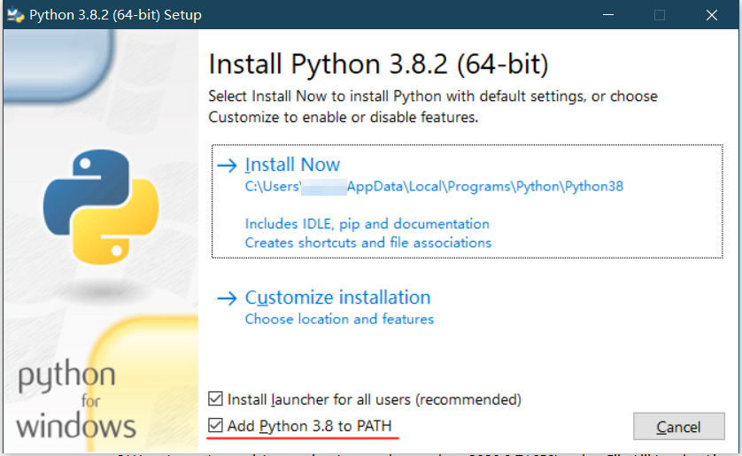

#1 Kepan Docsify 简介

**用支持一百零八级标题的 Markdown 语法来编写佛经科判。**

#2 什么是 Markdown ？

Markdown 是一种轻量级标记语言，可以很方便地编写文档，而不用过于关注文章格式。

它定义了一些非常简单的语法，来表示我们写文档时常用的格式，如标题、正文、列表、表格、粗体、斜体、链接、插图、引用，等等，Markdown 文档一般用 md 作为后缀，一般写成下面的样子：

```markdown
# 一级标题
## 二级标题
### 三级标题
#### 四级标题
##### 五级标题
###### 六级标题

正文部分，正文部分。正文部分，正文部分。
正文部分，正文部分。正文部分，正文部分。

- 不带编号的列表
- 不带编号

1. 带编号的列表
2. 带编号

**粗体** 两边各用两个星号括起来
_斜体_ 两边各用一个下划线括起来

[链接名称](https://bing.com/)

```

#2 Markdown 语法用来做科判有什么不足？

Markdown 以 `#、##、###、####、#####、######` 来代表各级标题，最大只有六级。事实上无论 Html 还是 Word ，默认都只有六级标题，而我们做佛经科判，有时候甚至需要多达上百层的标题，六层远远不够用。

#2 那要对 Markdown 语法做些什么改动呢？

修改现有的 Markdown 语法，不再使用 `#、##、###、####、#####、######` ，改以 `#1、#2、#3、#4、#5、#6……#107、#108` 来代表各级标题，并且从原来的最大六级标题扩展到最大一百零八级标题。

一百零八，是佛教的吉祥数。


也就是说，改进后，各级标题改用这样的写法：

```markdown
#1 天地玄黃
#2 宇宙洪荒
#3 日月盈昃
#4 辰宿列張
#5 寒來暑往
#6 秋收冬藏
#7 閏餘成歲
#8 律呂調陽
#9 雲騰致雨
#10 露結為霜
#11 金生麗水
#12 玉出昆岡
#13 劍號巨闕
#14 珠稱夜光
#15 果珍李柰
#16 菜重芥姜
#17 海咸河淡
#18 鱗潛羽翔
#19 龍師火帝
#20 鳥官人皇
#21 始製文字
#22 乃服衣裳
#23 推位讓國
#24 有虞陶唐
#25 吊民伐罪
#26 周發殷湯
#27 坐朝問道
#28 垂拱平章
#29 愛育黎首
#30 臣伏戎羌
#31 遐邇壹體
#32 率賓歸王
#33 鳴鳳在竹
#34 白駒食場
#35 化被草木
#36 賴及萬方
#37 蓋此身發
#38 四大五常
#39 恭惟鞠養
#40 豈敢毀傷
#41 女慕貞潔
#42 男效才良
#43 知過必改
#44 得能莫忘
#45 罔談彼短
#46 靡恃己長
#47 信使可覆
#48 器欲難量
#49 墨悲絲染
#50 詩贊羔羊
#51 景行維賢
#52 克念作聖
#53 德建名立
#54 形端表正
#55 空谷傳聲
#56 虛堂習聽
#57 禍因惡積
#58 福緣善慶
#59 尺璧非寶
#60 寸陰是競
#61 資父事君
#62 曰嚴與敬
#63 孝當竭力
#64 忠則盡命
#65 臨深履薄
#66 夙興溫清
#67 似蘭斯馨
#68 如松之盛
#69 川流不息
#70 淵澄取映
#71 容止若思
#72 言辭安定
#73 篤初誠美
#74 慎終宜令
#75 榮業所基
#76 籍甚無竟
#77 學優登仕
#78 攝職從政
#79 存以甘棠
#80 去而益詠
#81 樂殊貴賤
#82 禮別尊卑
#83 上和下睦
#84 夫唱婦隨
#85 外受傅訓
#86 入奉母儀
#87 諸姑伯叔
#88 猶子比兒
#89 孔懷兄弟
#90 同氣連枝
#91 交友投分
#92 切磨箴規
#93 仁慈隱惻
#94 造次弗離
#95 節義廉退
#96 顛沛匪虧
#97 性靜情逸
#98 心動神疲
#99 守真誌滿
#100 逐物意移
#101 堅持雅操
#102 好爵自縻
#103 都邑華夏
#104 東西二京
#105 背邙面洛
#106 浮渭據涇
#107 宮殿盤鬱
#108 樓觀飛驚
```

显示效果参看本页最下方。为了避免影响页面目录结构把它放在了最下方。侧边栏也可以显示一百零八级的大纲视图。

#2 这个工作进展如何？

当然，你现在看到的这个科判网站，就是这个工作的成果。它使用修改过的 docsify 来实现。

#3 docsify 是什么？
docsify 是 github 上的一个开源项目，它是一个用 javascript 开发的文档网站生成器。

1. 首先它非常火。
它在 github 上截至 2020 年 4 月已经有 1.3 万星。

2. 其次它使用方便。
在硬盘上建个文件夹，把 docsify 的文件放进去，然后用 Markdown 语法随便写些 md 文件扔进去，在这个文件夹里启动一个简单的 Web 服务器，然后通过浏览器访问 http://localhost 就可以看到这些 md 文件变成漂亮的网页了。

3. 最主要是它好改。
docsify 为了解析 Markdown 语法，使用了 marked 解析库，而 marked 非常容易修改。

#3 marked 是什么？
marked 是 github 上的一个开源项目，它是一个用 javascript 开发的 Markdown 语法的解析和编译器。

1. 首先它更火。
它在 github 上截至 2020 年 4 月已经有 2.2 万星，是所有 Markdown 语法解析库中最火的。

2. 其次它很快。
它的设计思想就是 "**Built for speed.**"

3. 最主要是它好改。
总之就是无论 marked 还是 docsify ，改着都很方便。

#2 我想做科判，怎么使用这个系统？

用起来，有两种方式。

#3 在个人电脑上使用
由于浏览器的安全设置，直接双击 index.htm 是没法读取 md 文档的，需要启动一个 Web 服务器，然后通过浏览器来访问。

1. 作为最简单的 Web 服务器解决方案，建议是下载安装 Python3 ：
    - 下载地址： https://www.python.org/downloads/windows/
    - 下载最新版的 `Windows x86-64 executable installer` 即可；
    - 安装时一定要勾选下面的 `Add Python 3.x to PATH` 选项：
    


2. 在硬盘上合适的位置创建一个文件夹，作为本地网站的根目录；

3. 解压 kepan-docsify.zip ，把里面的文件全都复制到这个文件夹；

4. 双击 server.cmd 启动简单 Web 服务器，不要关闭命令窗口；
关闭窗口，Web 服务就关闭了。

5. 然后用浏览器访问 http://localhost 即可。

#3 有服务器？那就架个网站

1. 在服务器上合适的位置创建一个文件夹，作为网站的根目录；

2. 适当设置，让这个文件夹可以通过网址访问；

3. 解压 kepan-docsify.zip ，把里面的文件通过 FTP 上传到这个文件夹；

4. 然后用浏览器访问对应的网址即可。

#2 我该怎么往里面添加一个页面呢？

默认情况下，每个子目录下，要有一个 README.md ，相当于这个子目录的默认首页。

比方说，我们访问 http://localhost/#/help ，实际上访问到的是 `help/README.md` 。

那么如果希望添加更多的页面该怎么办呢？可以照着下面的步骤实际操作。

#3 第一步：创建一个 md 文件

这个 md 文件放在哪里都可以，比方说放进 docs 目录下，名字叫 "这是一卷科判.md"，文件名是中文英文、繁体简体，都无所谓。

然后编辑这个 md 文件的内容，往里面随便写点儿内容，不能是空的，会报告找不到。

```markdown
#1 这是一篇科判

这是一段简介。

这是一段简介。
```
现在这个文档已经可以从浏览器中访问了，访问地址是：
* 如果是在个人电脑上
    * http://localhost/#/docs/这是一卷科判
* 如果是在服务器上
    * http://abcde.com/#/docs/这是一卷科判

也就是说，`http://网站地址/#/子目录/不带 .md 后缀的文件名`

#3 第二步：把新文档的链接添加到首页

然后我们编辑根目录下的 README.md ，这个文件，就是首页，我们把新文档的链接添加进去：

```markdown
* [一卷科判](docs/这是一卷科判)
```

好了，在浏览器中刷新一下首页，看看效果。


#2 相关链接

#3 我去哪里下载你说的这个 kepan-docsify.zip ？
点击本站上方导航栏 [下载](/down/) 即可。

系统的版本会不定时更新，请留意版本号的变化。

#3 我去哪里进一步学习 docsify 的使用细节？
点击本站上方导航栏 [官方文档](https://docsify.js.org/#/zh-cn/) 即可。

这是官方文档的中文版，看着很方便。

#3 我去哪里进一步学习 Markdown 语法？
简单的标准 Markdown 基本语法可参看这篇 [Markdown 基本语法](help/markdown) 。

然后我们不使用 `#、##、###、####、#####、######` ，而改以 `#1、#2、#3、#4、#5、#6……#107、#108` 来代表各级标题。

如果还想进一步学习……

内事不决问 [必应](https://bing.com) ，外事不决问 [谷歌](https://google.com) 。

#3 用什么工具来编辑 md 文件方便呢？

Markdown 语法非常简单，其实用记事本或者自己喜欢的任何编辑器手写都可以。

如果你需要支持 Markdown 的语法高亮，或者实时预览功能的编辑器的话，也有不少，可以参考这篇文章：
* [主流 Markdown 编辑器推荐](https://zhuanlan.zhihu.com/p/69210764)

比方说，你可以使用 VSCode ：
* [Visual Studio Code](https://code.visualstudio.com/)

这些编辑器都没法识别 `#1、#2、#3、#4、#5、#6……#107、#108` 一百零八级标题方案，这是我们下一步要努力的方向。

#3 我去哪里看源代码？

* marked 和 docsify 官方代码
    * https://github.com/docsifyjs/docsify
    * https://github.com/markedjs/marked

* Kepan Docsify 代码
    * github 仓库（国外）
        * https://github.com/vagra/kepan-docsify
        * https://github.com/vagra/marked
        * https://github.com/vagra/docsify
    * gitee 仓库（国内）
        * https://gitee.com/pinsa/kepan-docsify
        * https://gitee.com/pinsa/marked
        * https://gitee.com/pinsa/docsify

----

下面是前面那个一百零八级标题的显示效果，请注意侧边栏中大纲视图的同步卷动。而且可以点击条目前面的 `+` `-` 符号来展开/折叠该条目。

#1 天地玄黃
#2 宇宙洪荒
#3 日月盈昃
#4 辰宿列張
#5 寒來暑往
#6 秋收冬藏
#7 閏餘成歲
#8 律呂調陽
#9 雲騰致雨
#10 露結為霜
#11 金生麗水
#12 玉出昆岡
#13 劍號巨闕
#14 珠稱夜光
#15 果珍李柰
#16 菜重芥姜
#17 海咸河淡
#18 鱗潛羽翔
#19 龍師火帝
#20 鳥官人皇
#21 始製文字
#22 乃服衣裳
#23 推位讓國
#24 有虞陶唐
#25 吊民伐罪
#26 周發殷湯
#27 坐朝問道
#28 垂拱平章
#29 愛育黎首
#30 臣伏戎羌
#31 遐邇壹體
#32 率賓歸王
#33 鳴鳳在竹
#34 白駒食場
#35 化被草木
#36 賴及萬方
#37 蓋此身發
#38 四大五常
#39 恭惟鞠養
#40 豈敢毀傷
#41 女慕貞潔
#42 男效才良
#43 知過必改
#44 得能莫忘
#45 罔談彼短
#46 靡恃己長
#47 信使可覆
#48 器欲難量
#49 墨悲絲染
#50 詩贊羔羊
#51 景行維賢
#52 克念作聖
#53 德建名立
#54 形端表正
#55 空谷傳聲
#56 虛堂習聽
#57 禍因惡積
#58 福緣善慶
#59 尺璧非寶
#60 寸陰是競
#61 資父事君
#62 曰嚴與敬
#63 孝當竭力
#64 忠則盡命
#65 臨深履薄
#66 夙興溫清
#67 似蘭斯馨
#68 如松之盛
#69 川流不息
#70 淵澄取映
#71 容止若思
#72 言辭安定
#73 篤初誠美
#74 慎終宜令
#75 榮業所基
#76 籍甚無竟
#77 學優登仕
#78 攝職從政
#79 存以甘棠
#80 去而益詠
#81 樂殊貴賤
#82 禮別尊卑
#83 上和下睦
#84 夫唱婦隨
#85 外受傅訓
#86 入奉母儀
#87 諸姑伯叔
#88 猶子比兒
#89 孔懷兄弟
#90 同氣連枝
#91 交友投分
#92 切磨箴規
#93 仁慈隱惻
#94 造次弗離
#95 節義廉退
#96 顛沛匪虧
#97 性靜情逸
#98 心動神疲
#99 守真誌滿
#100 逐物意移
#101 堅持雅操
#102 好爵自縻
#103 都邑華夏
#104 東西二京
#105 背邙面洛
#106 浮渭據涇
#107 宮殿盤鬱
#108 樓觀飛驚